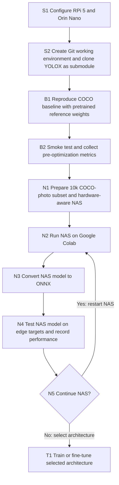
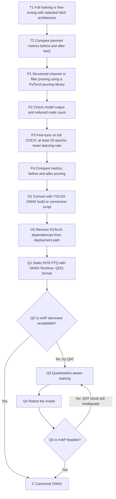
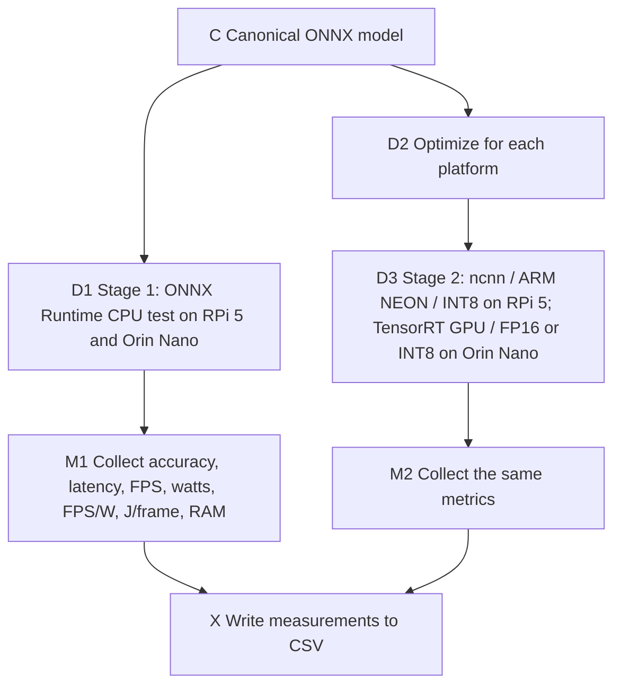

# Edge Object Detection: NAS, Pruning, Quantization, and Deployment

## Purpose and source fidelity

This document transcribes the supplied thesis workflow diagram into an agent-readable plan. It distinguishes **steps shown in the diagram**, **decision branches**, **example output**, and **details that still need to be specified**. It is a workflow specification, not evidence that any experiment has already run.

### Targets and terminology

| Term | Meaning in this workflow |
| --- | --- |
| RPi 5 | Raspberry Pi 5 target device. |
| Orin Nano | NVIDIA Jetson Orin Nano target device. The setup box in the source says “Jetson Orin NANO.” |
| COCO | Dataset used for the baseline, NAS photo subset, and later full-data fine-tuning. |
| YOLOX-NAS / NAS | The architecture search model/process named in the source. Exact code and search configuration are unspecified. |
| mAP | Detection accuracy metric. The diagram does not specify IoU convention or split. |
| ONNX | Intermediate model representation used before the runtime-specific paths. |
| PTQ / QDQ | Static post-training INT8 quantization in Quantize-Dequantize ONNX format. |
| QAT | Quantization-aware training, considered if PTQ decreases mAP too much. |
| Stage 1 | CPU runtime test with ONNX Runtime on both devices. |
| Stage 2 | Platform-specific optimized runtime test: ncnn on RPi 5; TensorRT on Orin Nano. |

## Workflow chart

The charts are split by phase for readability. Node IDs match the step table below.

### 1. Setup, baseline, and hardware-aware search

**Baseline gate:** The reference pretrained model must run successfully before optimization. Save its measured metrics to enable comparisons before and after NAS and later optimizations. The image does not define a numeric pass threshold.

### 2. Training, pruning, and quantization

**Quantization loop caveat:** The drawing shows “keep going with QAT” when mAP is still inadequate, but gives no stopping rule, retry limit, or fallback. An agent must request or define those before automating that loop.

### 3. Deployment and benchmark outputs

The source also calls for a **USB-C power analyzer** to measure physical power and mentions using the **tegrastats** command on Jetson. It does not state whether tegrastats replaces or supplements the power analyzer; record both separately if both are used.

## Executable step register

| ID | Action shown in diagram | Expected artifact or observation |
| --- | --- | --- |
| S1 | Configure Raspberry Pi 5 and Jetson Orin Nano. | Both target environments available. |
| S2 | Create Git working environment; clone YOLOX repository as a submodule. | Versioned workspace with pinned YOLOX revision. |
| B1 | Reproduce COCO baseline using pretrained reference weights. | Reference model runs; smoke test succeeds. |
| B2 | Gather planned comparison metrics before optimization. | Baseline measurement record. |
| N1 | Use a 10k-photo COCO subset for hardware-aware NAS. | Search dataset definition and hardware objectives. |
| N2 | Start NAS on Google Colab. | Search run, configuration, and selected candidate(s). |
| N3 | Convert candidate NAS model to ONNX. | NAS candidate ONNX model. |
| N4 | Try YOLOX-NAS model on edge environments; obtain performance output. | Edge evaluation record. |
| N5 | Decide whether to continue NAS according to its output; if yes, restart NAS. | Recorded decision and selected architecture if proceeding. |
| T1 | Full training or fine-tuning with selected NAS architecture and chosen epoch count. | Trained model checkpoint. |
| T2 | Compare planned metrics before and after NAS. | NAS comparison. |
| P1 | Perform structured channel/filter pruning using a PyTorch pruning library. | Pruned architecture/model. |
| P2 | Get model output with reduced node count. | Correctness and structural reduction check. |
| P3 | Fine-tune pruned model with full COCO data, lower learning rate, and at least 20 epochs. | Recovered pruned-model checkpoint. |
| P4 | Compare planned metrics before and after pruning/fine-tuning. | Pruning comparison. |
| O1 | Convert with YOLOX ONNX conversion/build script. | Deployment ONNX candidate. |
| O2 | Remove deployment-time PyTorch dependencies. | ONNX deployment path without PyTorch dependency. |
| Q1 | Run calibrated static INT8 PTQ via ONNX Runtime in QDQ format. | Quantized ONNX candidate and calibration record. |
| Q2–Q5 | Assess mAP drop; if unacceptable, perform QAT and retest until feasible. | Accepted quantized model or unresolved QAT decision. |
| C | Establish canonical ONNX model. | Named/versioned model for runtime testing and platform optimization. |
| D1 | Stage 1: ONNX Runtime CPU tests on both devices. | Per-device CPU benchmark. |
| D2–D3 | Stage 2: optimize for target runtime and test ncnn/ARM NEON/INT8 on RPi 5; TensorRT GPU/FP16 or INT8 on Orin Nano. | Per-device optimized benchmark. |
| M1–M2 | Record accuracy, timing, throughput, power, efficiency, memory; use USB-C power analyzer and Jetson tegrastats where applicable. | Complete per-run metric record. |
| X | Export all metrics to CSV and compare stages. | CSV of measured runs. |

## Measurement schema

These are the fields and units explicitly present across the metric boxes and final table. Preserve **one row per device × stage × runtime × precision × input size × measurement run**. The table's F1–F4 and W1–W4 are placeholders, not observed values.

| Field | Description / unit |
| --- | --- |
| `device` | RPi 5 or Jetson Orin Nano. |
| `optimization_stage` | Stage-1 or Stage-2. |
| `runtime_backend` | ONNX Runtime CPU, ncnn, or TensorRT GPU, as appropriate. |
| `model_type_precision` | E.g., FP32, INT8, FP16, or INT8 (QDQ); distinguish ONNX model format from the precision actually executed by a runtime. |
| `input_size` | Model input dimensions; **416×416 is an example value in the image**. |
| `mAP` | Detection accuracy; dataset split and IoU convention remain unspecified. |
| `mean_latency_ms` | Average inference latency, milliseconds. |
| `throughput_fps` | Frames per second. |
| `power_w` | Power, watts. Specify whether this means total device or incremental inference power. |
| `efficiency_fps_per_w` | FPS ÷ W, if measured under compatible conditions. |
| `energy_j_per_frame` | W ÷ FPS, if the same power and throughput measurement window is used. |
| `ram` | Memory consumption; unit and measurement scope remain unspecified. |

### Example final table transcribed from the image

The original uses Turkish headers, a sample input size of 416×416, and symbolic measurements. Dashes below mean the diagram leaves a value blank.

| Device (`Cihaz`) | Stage (`Optimizasyon Aşaması`) | Backend (`Arka Uç`) | Model type | Input size | Mean latency (ms) | FPS | Power (W) | FPS/W | J/frame |
| --- | --- | --- | --- | --- | --- | --- | --- | --- | --- |
| RPi 5 | Stage-1 | ORT CPU | FP32 | 416×416 | Measurement 1 | F1 | W1 | F1/W1 | W1/F1 |
| Jetson Orin Nano | Stage-1 | ORT CPU | FP32 | 416×416 | Measurement 2 | F2 | W2 | F2/W2 | W2/F2 |
| RPi 5 | Stage-2 | ncnn | INT8 | 416×416 | Measurement 3 | F3 | W3 | F3/W3 | W3/F3 |
| Jetson Orin Nano | Stage-2 | TensorRT | INT8 (QDQ) | 416×416 | Measurement 4 | F4 | W4 | F4/W4 | W4/F4 |

The Stage 2 Jetson box also lists FP16, but the **illustrative final table** shows only INT8 (QDQ). Add FP16 rows if that path is tested. The table has no mAP or RAM columns even though the metric boxes request them; include both in the actual CSV.

**Model version ambiguity:** The image places “Canonical ONNX” after the INT8/QAT branch, yet labels both Stage 1 CPU rows FP32. A single INT8 ONNX artifact cannot be assumed to be the FP32 baseline. Retain and name separate FP32 and quantized candidates, then specify which artifact feeds each benchmark row.

## Decisions that must be fixed before an agent runs experiments

1. Pin YOLOX revision, pretrained weights, dependencies, device software versions, and exact device configurations.
2. Specify COCO baseline and search subset selection, training/validation split, mAP definition, and data preprocessing.
3. Define NAS search space, hardware objectives, resource budgets, acceptance criteria, and restart/stopping rule.
4. Set training epochs and learning rates; clarify whether “full training” and “fine-tune” refer to the same operation in T1.
5. Set pruning ratio and structure, verify post-pruning graph compatibility, and define acceptable accuracy loss.
6. Define calibration data, acceptable PTQ mAP decrease, QAT protocol, retry limit, and fallback if QAT remains inadequate.
7. Fix ONNX opset, dynamic/static shapes, actual INT8/FP16 support for each backend, and model equivalence checks after conversion.
8. Define warm-up, run count, batch size, latency statistic, FPS method, power measurement window, idle-power treatment, and RAM unit. Keep settings identical where comparisons require it.

**Agent execution rule:** Do not fill unspecified settings or placeholder metrics as facts. Record chosen settings, artifacts, failed steps, and measurements with provenance; stop at decision gates when their thresholds are not supplied.
