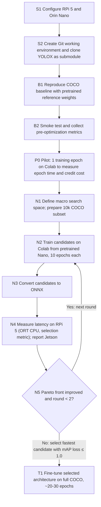
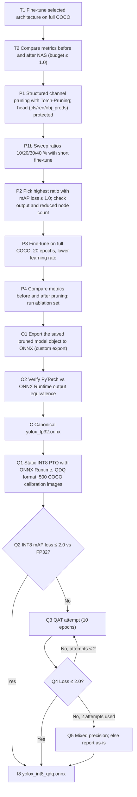
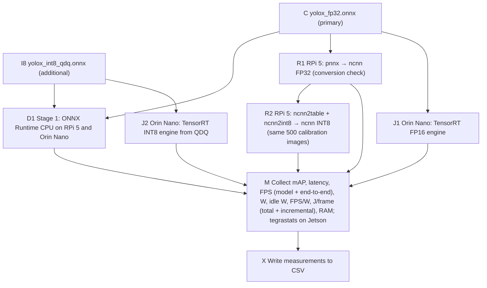

# Edge Object Detection: NAS, Pruning, Quantization, and Deployment

## Purpose and source fidelity

This document transcribes the supplied thesis workflow diagram into an agent-readable plan. It distinguishes **steps shown in the diagram**, **decision branches**, **example output**, and **details that still need to be specified**. It is a workflow specification, not evidence that any experiment has already run.

**Revision 2026-10-03:** The plan now reflects Decisions 1–5 agreed with the thesis author (see [Decision log](#decision-log-2026-10-03)). Where a decision changed the original diagram, the change is stated explicitly. The editable diagram is `Tez İş Akışı.canvas`; the Turkish step-by-step guide is `Edge Object Detection Project Workflow.md`.

### Targets and terminology

| Term | Meaning in this workflow |
| --- | --- |
| RPi 5 | Raspberry Pi 5 target device. |
| Orin Nano | NVIDIA Jetson Orin Nano target device. The setup box in the source says “Jetson Orin NANO.” |
| COCO | Dataset used for the baseline, the 10k-image search subset, full-data fine-tuning, and calibration (500 fixed train images). |
| YOLOX-Nano | Base model. Reference COCO val2017 mAP@[.5:.95] = 25.8 at 416×416, 0.91M params, 1.08 GFLOPs (YOLOX README). |
| NAS | **Hardware-aware macro-architecture search** over a discrete space (resolution, activation, CSP depth, depthwise kernel size), starting from pretrained YOLOX-Nano weights. Not classic NAS (Decision 5). |
| mAP | COCO val2017 mAP@[.5:.95] (primary) and mAP@.5 (secondary), with identical pre/post-processing and NMS for every model (Decision 2). |
| ONNX | Intermediate model representation. `yolox_fp32.onnx` is the canonical reference; `yolox_int8_qdq.onnx` is derived from it (Decision 1). |
| PTQ / QDQ | Static post-training INT8 quantization in Quantize-Dequantize ONNX format (ONNX Runtime). |
| QAT | Quantization-aware training, used if PTQ loses more than 2.0 mAP points: at most 2 attempts × 10 epochs (Decision 2). |
| Stage 1 | CPU runtime test with ONNX Runtime on both devices: FP32 (primary data) and INT8 QDQ (additional data). |
| Stage 2 | Platform-specific runtime test: ncnn FP32 + ncnn INT8 on RPi 5; TensorRT FP16 + TensorRT INT8 (QDQ) on Orin Nano (Decision 4). |

## Decision log (2026-10-03)

| # | Decision | Details |
| --- | --- | --- |
| 1 | Canonical ONNX = FP32 | `yolox_fp32.onnx` (after pruning + fine-tuning) is the reference. `yolox_int8_qdq.onnx` is derived from it and measured separately in Stage 1 as additional data. Every benchmark row names its artifact. |
| 2 | Accuracy gates | mAP@[.5:.95] on val2017 (mAP@.5 secondary). INT8 loss ≤ 2.0 points vs FP32. QAT: max 2 attempts × 10 epochs. Fallback: mixed precision (sensitive layers, e.g. detection head, in FP16/FP32), else report as-is. Total loss vs original YOLOX-Nano ≤ 4.0 points (floor ≈ 21.8). |
| 3 | Power & measurement protocol | Primary power: USB-C meter at the input of both devices (total board power); only this is used across devices. Idle power measured each session. J/frame reported as total (W/FPS) and incremental ((W−W_idle)/FPS). tegrastats: Jetson-only, separate column. 100 warm-up inferences, then 60 s steady-state × 3 repeats, mean ± std. Fixed nvpmodel/jetson_clocks, RPi governor, cooling; no peripherals; meter sampling rate recorded. FPS: model-only (primary) and end-to-end (pre-process + model + NMS) as a separate column. |
| 4 | Stage-2 INT8 sources | TensorRT INT8 is built from the QDQ model (explicit quantization), not TensorRT's own calibrator. TensorRT FP16 is added from the FP32 ONNX. ncnn **cannot** consume QDQ ONNX (verified in ncnn source, commit `9f9d4ec`, and issue Tencent/ncnn#5183), so ncnn INT8 is produced from the FP32 pnnx model with `ncnn2table` + `ncnn2int8`, using the same 500 calibration images. An ncnn FP32 row validates the conversion. Each INT8 model's mAP is measured on its device; the 2.0-point gate applies to each. |
| 5 | Macro-architecture search & pruning | Classic NAS rejected: full COCO training (~300 epochs) per candidate exceeds the Colab Pro budget (~400 credits); classic NAS on PASCAL VOC was also rejected (from-scratch baseline needed, breaks the COCO-based gates, changes the research question). Search changes **architecture** (resolution 320/416/512, activation SiLU/ReLU/HardSwish, CSP depth current/−1, DW kernel 3/5) and never channel widths — **width is the pruning step's job**. Candidates start from pretrained YOLOX-Nano, 10 epochs on the 10k subset. Selection metric: latency on **RPi 5 with ONNX Runtime CPU**; fastest candidate within the NAS budget wins; Jetson latency reported only. One architecture for both devices. Max 2 rounds; stop if the Pareto front does not improve. Selected architecture fine-tuned ~20–30 epochs on full COCO. Per-stage mAP budget: NAS ≤ 1.0 · pruning ≤ 1.0 · INT8 ≤ 2.0. Pruning ratio swept over 10/20/30/40 % with a short fine-tune; highest ratio within budget gets the full 20-epoch fine-tune. Ablation: baseline · NAS only · pruning only · NAS + pruning. |

## Workflow chart

The charts are split by phase for readability. Node IDs match the step table below.

### 1. Setup, baseline, and hardware-aware search

**Baseline gate:** The reference pretrained model must run successfully before optimization. Save its measured metrics to enable comparisons before and after NAS and later optimizations. Reference value: 25.8 mAP@[.5:.95] (val2017, 416).

**Diagram change:** The original diagram showed an open-ended “Restart NAS / Continue” loop with “Start NAS on Google Colab”. Decision 5 replaced it with a bounded macro-architecture search (≤ 2 rounds) and added the pilot epoch P0.

### 2. Training, pruning, and quantization

**Pruning code fix:** The original guide protected the head by matching `out_channels == 85`. YOLOX's head has separate per-level `cls_preds` (num_classes), `reg_preds` (4) and `obj_preds` (1) convolutions (`yolox/models/yolo_head.py`), so that filter matched nothing. The head modules are now protected directly.

**Export fix:** The pruned model is saved as a full object with changed layer shapes, so `tools/export_onnx.py` (which rebuilds the model and loads a `state_dict`) cannot load it. The saved object is exported directly, keeping the script's defaults (input `images`, output `output`, `decode_in_inference=False`).

### 3. Deployment and benchmark outputs

Power is measured with a **USB-C power meter** at the input of both devices (primary). **tegrastats** on Jetson is recorded as a separate, supplementary column and is not used for cross-device comparison (Decision 3).

## Executable step register

| ID | Action | Expected artifact or observation |
| --- | --- | --- |
| S1 | Configure Raspberry Pi 5 and Jetson Orin Nano. | Both target environments available. |
| S2 | Create Git working environment; clone YOLOX repository as a submodule. | Versioned workspace with pinned YOLOX revision. |
| B1 | Reproduce COCO baseline using pretrained reference weights. | Reference model runs; smoke test succeeds. |
| B2 | Gather comparison metrics before optimization. | Baseline measurement record (reference 25.8 mAP). |
| P0 | Run a 1-epoch pilot training on Colab. | Measured epoch time and credit cost; full training budget computed from it. |
| N1 | Define the macro search space; build the 10k-image COCO subset. | Search space and subset definition. |
| N2 | Train each candidate from pretrained YOLOX-Nano for 10 epochs on Colab. | Candidate checkpoints and mAP. |
| N3 | Convert candidates to ONNX. | Candidate ONNX models. |
| N4 | Measure latency on RPi 5 with ORT CPU (selection metric); measure Jetson for reporting. | Latency table per candidate. |
| N5 | Stop after 2 rounds or when the Pareto front does not improve; select the fastest candidate with mAP loss ≤ 1.0. | Selected architecture (`nas_optimized.py`). |
| T1 | Fine-tune the selected architecture on full COCO, ~20–30 epochs. | `nas_optimized.pth`. |
| T2 | Compare metrics before and after NAS. | NAS comparison (budget ≤ 1.0). |
| P1 | Structured channel pruning with Torch-Pruning; head modules protected. | Pruned model. |
| P1b–P2 | Sweep 10/20/30/40 % with short fine-tune; select highest ratio with loss ≤ 1.0; check output and node count. | Chosen ratio and pruned model. |
| P3 | Fine-tune the pruned model on full COCO, lower learning rate, 20 epochs. | Recovered pruned checkpoint (saved as full model object). |
| P4 | Compare metrics before and after pruning; evaluate the ablation set (baseline, NAS only, pruning only, NAS + pruning). | Pruning comparison and ablation table. |
| O1–O2 | Export the saved model object to ONNX; verify PyTorch vs ORT output equivalence. | `yolox_fp32.onnx` with equivalence check. |
| C | Establish the canonical FP32 ONNX model. | `yolox_fp32.onnx` (Decision 1). |
| Q1 | Run calibrated static INT8 PTQ via ONNX Runtime in QDQ format (500 fixed COCO train images). | `yolox_int8_qdq.onnx` and calibration record. |
| Q2–Q5 | Accept if loss ≤ 2.0; else QAT (max 2 × 10 epochs); else mixed precision; else report as-is. | Accepted INT8 model or documented fallback. |
| D1 | Stage 1: ORT CPU on both devices, FP32 (primary) and INT8 QDQ (additional). | Per-device CPU benchmark. |
| R1–R2 | Stage 2 RPi 5: ncnn FP32 (conversion check) and ncnn INT8 via `ncnn2table`/`ncnn2int8`. | ncnn models and benchmark. |
| J1–J2 | Stage 2 Orin Nano: TensorRT FP16 from FP32 ONNX and TensorRT INT8 from QDQ ONNX, built on the device. | TensorRT engines and benchmark. |
| M | Record all metrics per Decision 3 protocol. | Complete per-run metric record. |
| X | Export all metrics to CSV and compare stages. | CSV of measured runs. |

## Measurement schema

Preserve **one row per device × stage × runtime × precision × input size × measurement run**. All values below are placeholders, not observed values.

| Field | Description / unit |
| --- | --- |
| `device` | RPi 5 or Jetson Orin Nano. |
| `optimization_stage` | Stage-1 or Stage-2. |
| `runtime_backend` | ONNX Runtime CPU, ncnn, or TensorRT GPU. |
| `model_type_precision` | FP32, INT8 (QDQ), INT8 (ncnn2int8), FP16. Names the artifact that was executed. |
| `input_size` | Model input dimensions; 416×416 is an example — the real value is the resolution chosen by the search. |
| `mAP` | COCO val2017 mAP@[.5:.95] (and mAP@.5 recorded separately), measured for every model on its target runtime. |
| `mean_latency_ms` | Model-only latency, mean ± std over 3 × 60 s windows after 100 warm-up inferences. |
| `throughput_fps_model` | Model-only frames per second. |
| `throughput_fps_e2e` | End-to-end FPS: pre-process + model + NMS on real images. |
| `power_w` | Total board power from the USB-C meter at the input, same window as FPS. |
| `idle_power_w` | Idle power measured in the same session. |
| `efficiency_fps_per_w` | FPS ÷ W. |
| `energy_j_per_frame_total` | W ÷ FPS. |
| `energy_j_per_frame_incremental` | (W − idle W) ÷ FPS. |
| `ram_mb` | Peak RAM in MB (`/usr/bin/time -v`). |
| `tegrastats_w` | Jetson only: on-board rail power from tegrastats; supplementary, not used for cross-device comparison. |

### Example final table

Symbolic values only; nothing has been measured.

| Device | Stage | Backend | Model type | Input | mAP | Latency (ms) | FPS (model) | FPS (e2e) | Power (W) | Idle (W) | FPS/W | J/frame (total) | J/frame (incr.) | RAM (MB) | tegrastats (W) |
| --- | --- | --- | --- | --- | --- | --- | --- | --- | --- | --- | --- | --- | --- | --- | --- |
| RPi 5 | Stage-1 | ORT CPU | FP32 | 416×416 | mAP1 | M1 | F1 | E1 | W1 | I1 | F1/W1 | W1/F1 | (W1−I1)/F1 | R1 | — |
| Jetson Orin Nano | Stage-1 | ORT CPU | FP32 | 416×416 | mAP2 | M2 | F2 | E2 | W2 | I2 | F2/W2 | W2/F2 | (W2−I2)/F2 | R2 | T2 |
| RPi 5 | Stage-1 | ORT CPU | INT8 (QDQ), additional | 416×416 | mAP1b | M1b | F1b | E1b | W1b | I1b | F1b/W1b | W1b/F1b | (W1b−I1b)/F1b | R1b | — |
| Jetson Orin Nano | Stage-1 | ORT CPU | INT8 (QDQ), additional | 416×416 | mAP2b | M2b | F2b | E2b | W2b | I2b | F2b/W2b | W2b/F2b | (W2b−I2b)/F2b | R2b | T2b |
| RPi 5 | Stage-2 | ncnn | FP32 (conversion check) | 416×416 | mAP3a | M3a | F3a | E3a | W3a | I3a | F3a/W3a | W3a/F3a | (W3a−I3a)/F3a | R3a | — |
| RPi 5 | Stage-2 | ncnn | INT8 (ncnn2int8) | 416×416 | mAP3 | M3 | F3 | E3 | W3 | I3 | F3/W3 | W3/F3 | (W3−I3)/F3 | R3 | — |
| Jetson Orin Nano | Stage-2 | TensorRT | FP16 | 416×416 | mAP4a | M4a | F4a | E4a | W4a | I4a | F4a/W4a | W4a/F4a | (W4a−I4a)/F4a | R4a | T4a |
| Jetson Orin Nano | Stage-2 | TensorRT | INT8 (QDQ) | 416×416 | mAP4 | M4 | F4 | E4 | W4 | I4 | F4/W4 | W4/F4 | (W4−I4)/F4 | R4 | T4 |

**Comparison rule:** Stage 1 compares the two devices on the same FP32 model and runtime. Stage 2 does not race the devices against each other; it documents each method's effect on its own device. A speed-up attributed purely to a compiler must compare the same device and precision (e.g. ncnn FP32 ÷ ORT FP32 on RPi 5).

## Decisions that must be fixed before an agent runs experiments

Status as of 2026-10-03.

1. **Open:** Pin YOLOX revision, pretrained weights, dependencies, device software versions, and exact device configurations.
2. **Partly resolved:** mAP definition and subsets resolved (Decisions 2 and 5). Open: exact 10k subset sampling procedure, YOLOX pre-processing values (also needed as `mean`/`norm` for `ncnn2table`).
3. **Resolved:** Search space, hardware objective, acceptance criterion and stopping rule (Decision 5). Open: Colab budget, to be computed after the 1-epoch pilot (P0).
4. **Partly resolved:** T1 is a fine-tune (~20–30 epochs on full COCO) of the selected architecture, not training from scratch. Open: learning rates.
5. **Resolved:** Pruning structure, ratio selection and acceptable loss (Decision 5).
6. **Partly resolved:** Calibration data (500 COCO train images), acceptable PTQ loss, QAT limit and fallback (Decision 2). Open: `per_channel` weight quantization (per-tensor may hurt depthwise convolutions), QAT tool and QAT-to-QDQ export path.
7. **Partly resolved:** Static input shape; INT8/FP16 path per backend (Decision 4). Open: ONNX opset (YOLOX default 11 used for now).
8. **Resolved:** Warm-up, run count, latency statistic, FPS method, power window, idle-power treatment, RAM unit (Decision 3). Open: ORT thread count value (fixed and identical on both devices).

**Agent execution rule:** Do not fill unspecified settings or placeholder metrics as facts. Record chosen settings, artifacts, failed steps, and measurements with provenance; stop at decision gates when their thresholds are not supplied.
